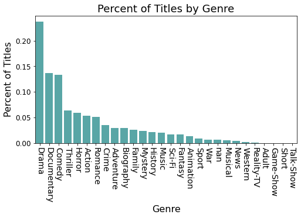
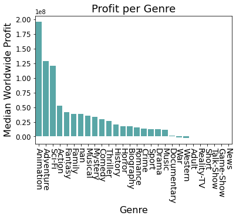
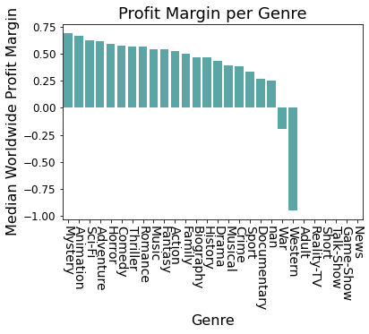
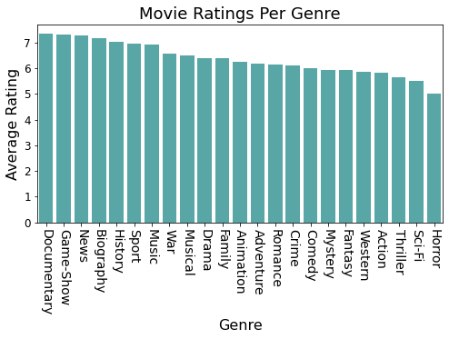
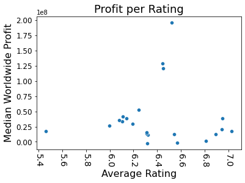
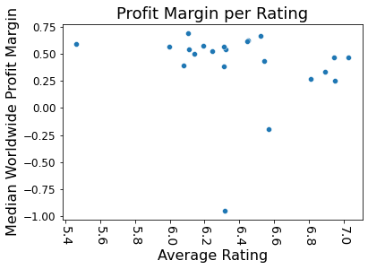
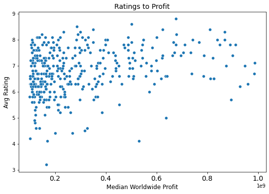
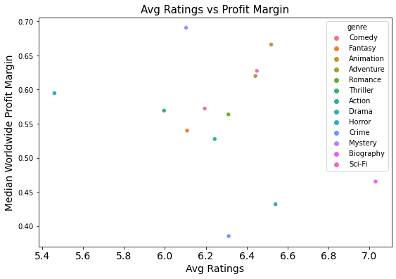

# Microsoft Wants to be in the Movie Biz

**Author**: [Becky Strickland]


## Business Problem

Microsoft has decided to create a new movie studio. Microsoft wants to know what types of films are currently doing the best at the box office to help decide what type of films to create.

## Data

Movie info including titles, ratings, genres from imdb's website.
Movie financial info including budget, domestic  gross, and worldwide gross.


## Methods

This project uses descriptive analysis, including description of trends by genre. This provides an overview of what genres perform the best at the box office and what if any characteristics can help us predict this.

## Results

### What type of films are our competitors producing?



- Genres with most titles:
    1. Drama
    2. Documentary
    3. Comedy
    
- We can see from our visualization that our competitors primarily produce films associated with the Drama genre. About 24% of all films examined can be associated with the Drama genre. In second and third place are Documentary and Comedy at around 13-14% each. These three genres dominate all other genres; altogether they account for about half of all films produced.

### Do commonly produced genres earn higher profits? 

 
 
- Genres with highest ratings:
    1. Documentary
    2. Game-show
    3. News
- Genres with most profit:
    1. Animation
    2. Adventure
    3. Sci-Fi
- The 3 genres associated with half of all titles produced are nowhere in the top three earning genres.

### Do commonly produced genres have better margins? 



- The 3 genres associated with half of all titles produced are nowhere in the genres which have the best profit margin either.
    - Genres with highest ratings:
    1. Documentary
    2. Game-show
    3. News
    - Genres with most profit margin:
    1. Mystery
    2. Animation
    3. Sci-Fi

### What type of films are  highly rated by viewers?



- Genres with highest ratings:
    1. Documentary
    2. Game-show
    3. News
- Viewer ratings per genre are very similar with the exception of a slightly lower rating for Westerns. There could be a selection bias here because only individuals which have already decided they want to watch a certain genre will provide a rating.
- The only top three genre which overlaps with the top 3 produced genres is Documentary.
 
### Do highly rated genres earn higher profits?

 
 
- Do highly rated genres earn higher profits?
    - Genres with highest ratings:
    1. Documentary
    2. Game-show
    3. News
    - Genres with most profit:
    1. Animation
    2. Adventure
    3. Sci-Fi
- The 3 genres which received the highest average rating are not part of the top 3 earning genres.

### Do highly rated genres have better margins?

 

- Genres with highest ratings:
    1. Documentary
    2. Game-show
    3. News
- Genres with most profit margin:
    1. Mystery
    2. Animation
    3. Sci-Fi
- The 3 genres which received the highest average rating are not part of the genres with top 3 margins.

### Scatter Visualization of  Correlation: Average Rating vs Profit
> Just because our top 3 didn't align doesn't mean there is no overall pattern. Let's visualize all the data points to confirm.
 
 
 
- There doesn't appear to be any correlation between viewer ratings submitted on imbd and profit.
 
### Highest Profit Genres
 
 
 
- Genres with most profit:
    1. Animation
    2. Adventure
    3. Sci-Fi
- These three genres stand out in their profits far beyond other genres.
- We can see average ratings grouped by genre are not strongly related to total profits either.

### Best Margin Genres
 
 
 
  - Genres with best profit margin:
    1. Mystery (very low total profits not of interest to Microsoft)
    2. Animation
    3. Sci-Fi
- We can see average ratings by genre are also not strongly related to profit margin.


## Conclusions


- Profits and commonly produced genres:
    No relationship

- Profits and highly rated genres:
    No relationship
    
 - Genres with most profit:
    1. Animation
    2. Adventure
    3. Sci-Fi

## Recommendations

This analysis leads to three recommendations for Microsoft:

- Don't produce genres commonly produced by competitors. These genres do not correlate to profit.
- Don't produce genres solely based on viewer ratings. These genres do not correlate to profit.
- According to our current findings, Microsoft should invest in producing animation films since they have the best success globally.


### Next Steps

Further analyses could  help confirm  our recommendations and yield additional insights:

- Find other profit data source to expand to more titles
- Calculate Profit by Runtime
- Calculate Average # of reviews by genre
- Explore data outside of imdb
- Calculate correlation coefficient
- Investigate 74% of records lost in budget to imbd merge
    - Are the sample records representative of all the data?

## For More Information

See the full analysis in the [Jupyter Notebook](./Movie-Analysis.ipynb) or review this [presentation](./Movie-Analysis-Presentation.pdf).


## Repository Structure

```
├── Data
├── Images
├── Movie-Analysis.ipynb
├── GitHub-print.pdf
├── Movie-Analysis-Jupyter-Notebook.pdf
├── Movie-Analysis-Presentation.pdf
└── README.md
```